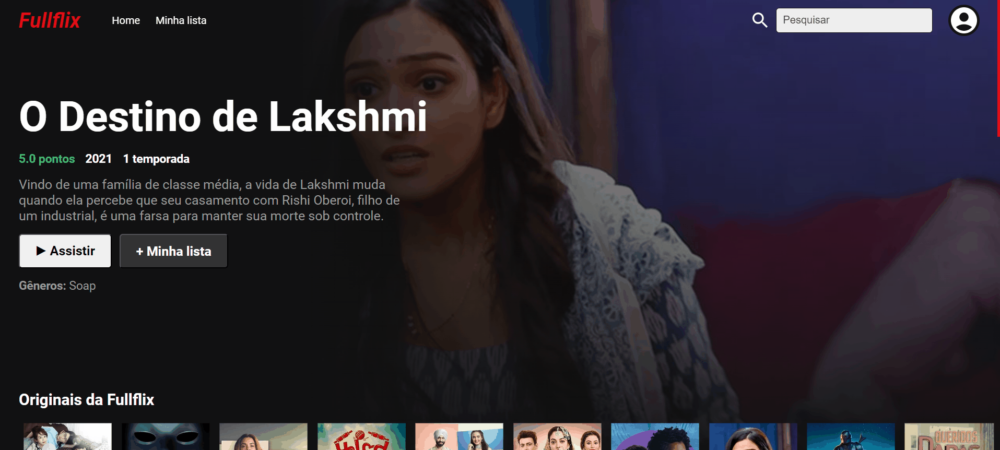

<h1 align="center">Fullflix</h1>

<p align="center">Este projeto é um serviço de streaming.</p>

<p align="center">
    <a href="#tecnologias">Tecnologias</a> &nbsp;&nbsp;•&nbsp;&nbsp;
    <a href="#pré-requisitos">Pré-requisitos</a> &nbsp;&nbsp;•&nbsp;&nbsp;
    <a href="#instalar-o-front-end">Instalar a aplicação</a> &nbsp;&nbsp;•&nbsp;&nbsp;
    <a href="#testar-a-aplicação">Testar a aplicação</a>
</p>

---

<br><br>

<div align="center">
    
    <br>
    
    <br>
    
    <br>
    
    <br>
    
</div>

<br><br>

## Tecnologias

Para o desenvolvimento deste projeto foram utilizadas as seguintes tecnologias:

- [React](https://reactjs.org/)
- [Material UI](https://mui.com/)
- [Context API](https://pt-br.reactjs.org/docs/context.html)
- [React Router](https://reactrouter.com/en/main)
- [Axios](https://axios-http.com/ptbr/)
- [React Hook Form](https://react-hook-form.com/)
- [Yup](https://github.com/jquense/yup)
- [ESLint](https://eslint.org/)
- [Prettier](https://prettier.io/)
- [EditorConfig](https://prettier.io/)

<br>

## Pré-requisitos

Para rodar esse projeto na sua máquina, você precisará instalar as seguintes ferramentas: [Git](https://git-scm.com), [Node.js](https://nodejs.org/en/).

O editor de código recomendado é o [Visual Studio Code](https://code.visualstudio.com/)

<br>

## Instalar o Front-End

```bash
# Clone este repositório
$ git clone https://github.com/NatanTeixeiraVieira/fullflix

# Acesse a pasta do projeto
$ cd fullflix

# Instale as dependências
$ npm install

# Execute a aplicação em modo de desenvolvimento
$ npm run dev
```

<br>

## Testar a aplicação

Caso queira testar a aplicação sem instalar nada: https://fullflix.netlify.app/

---

<br>

Made with ❤️ by Natãn Teixeira Vieira
